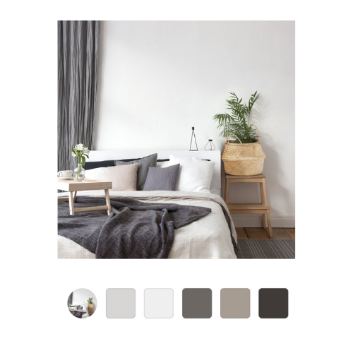
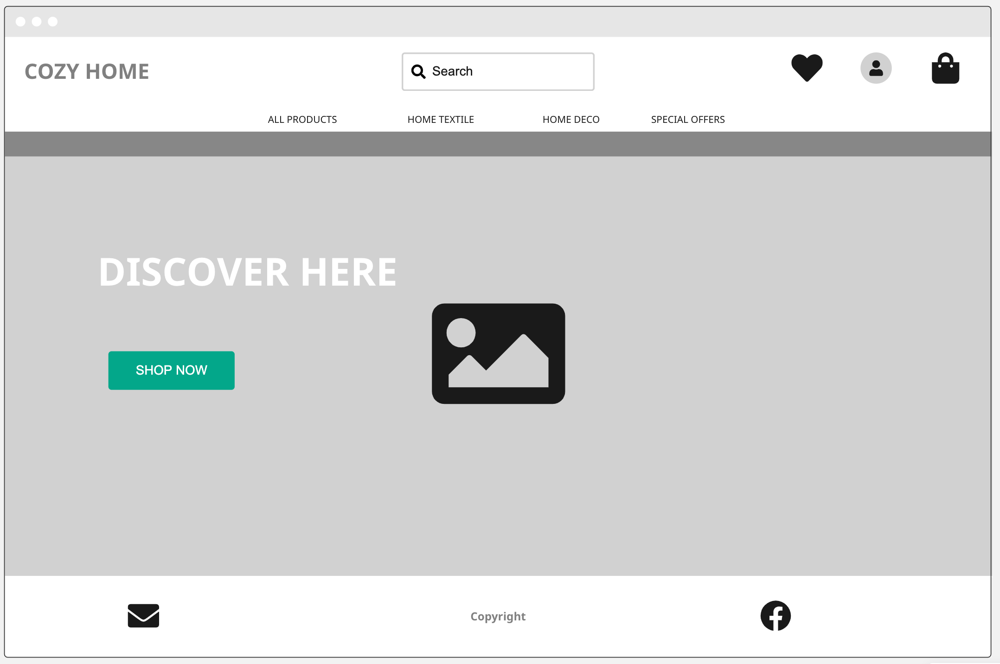
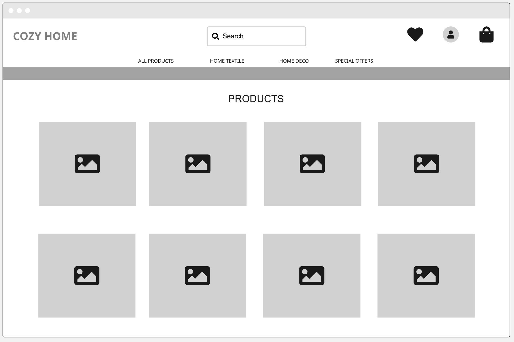
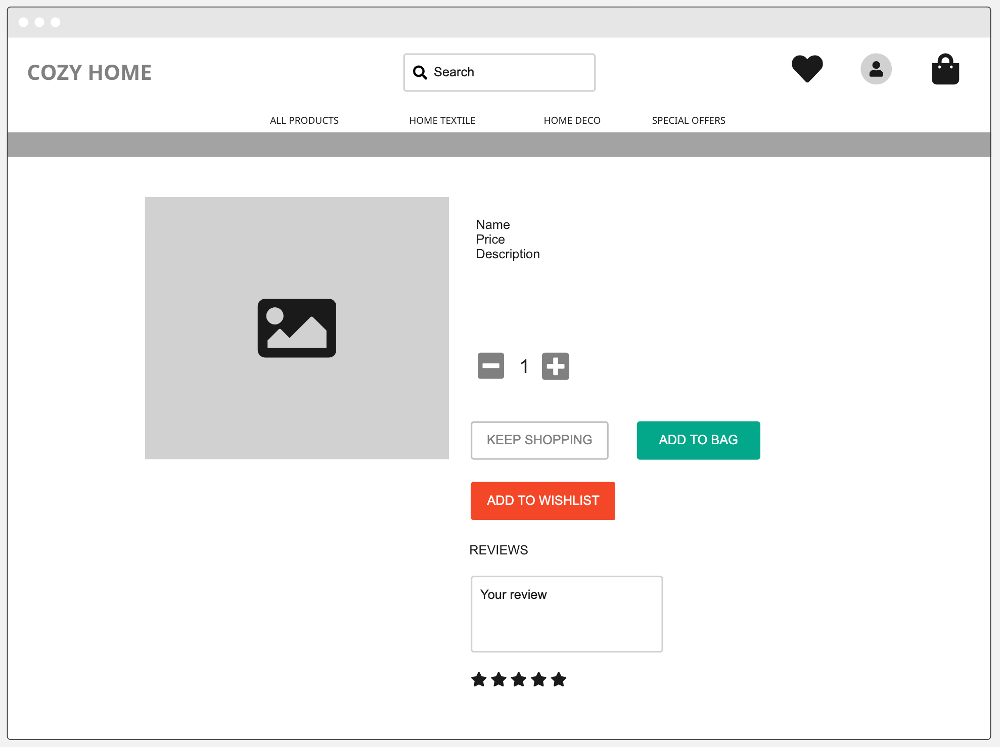
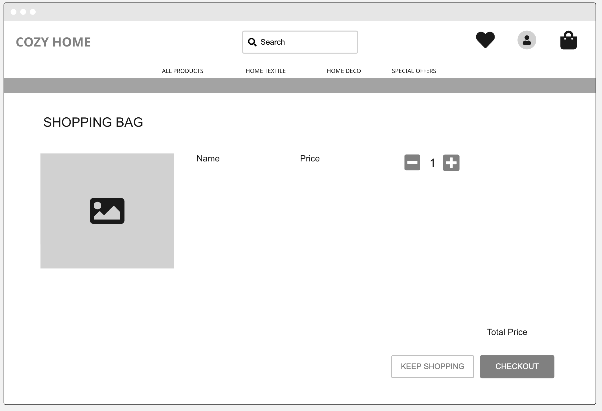
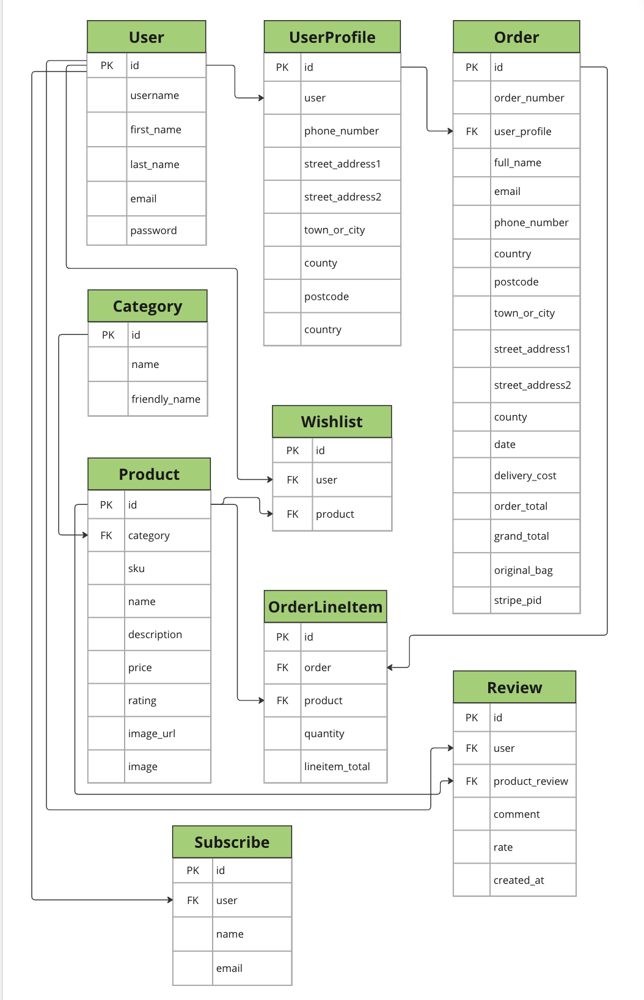

# Cozy Home

[View the live project here.](https://my-cozy-home-c15fa3106139.herokuapp.com/)

Cozy Home is an E-Commerce website for an online store named “Cozy Home”. Users can see products by categories and purchase them online. Users can register a profile, add products to wishlist, leave reviews, save delivery information, subscribe for a newsletter.

The website is designed to be responsive on a range of devices.

## Business and Customer Goals

The business model is B2C (Business to Customer). Customers can purchase goods online making individual card payments through the Stripe payment system.

### User Stories

#### Completed User Stories

Click on a user story to see the details.

1. [USER STORY: List of products](https://github.com/konstanciaa/cozy-home/issues/1)

2. [USER STORY: Product details](https://github.com/konstanciaa/cozy-home/issues/2)

3. [USER STORY: Special offers](https://github.com/konstanciaa/cozy-home/issues/3)

4. [USER STORY: View total](https://github.com/konstanciaa/cozy-home/issues/4)

5. [USER STORY: Wish list](https://github.com/konstanciaa/cozy-home/issues/5)

6. [USER STORY: Register an account](https://github.com/konstanciaa/cozy-home/issues/6)

7. [USER STORY: Login and logout](https://github.com/konstanciaa/cozy-home/issues/7)

8. [USER STORY: Email confirmation](https://github.com/konstanciaa/cozy-home/issues/9)

9. [USER STORY: User profile](https://github.com/konstanciaa/cozy-home/issues/10)

10. [USER STORY: Sort products by price](https://github.com/konstanciaa/cozy-home/issues/11)

11. [USER STORY: Sort a category](https://github.com/konstanciaa/cozy-home/issues/12)

12. [USER STORY: Search for a product](https://github.com/konstanciaa/cozy-home/issues/13)

13. [USER STORY: Select quantity of a product](https://github.com/konstanciaa/cozy-home/issues/14)

14. [USER STORY: View bag](https://github.com/konstanciaa/cozy-home/issues/15)

15. [USER STORY: Adjust quantity of items in bag](https://github.com/konstanciaa/cozy-home/issues/16)

16. [USER STORY: Enter payment details](https://github.com/konstanciaa/cozy-home/issues/17)

17. [USER STORY: Secure payment details](https://github.com/konstanciaa/cozy-home/issues/18)

18. [USER STORY: Order confirmation](https://github.com/konstanciaa/cozy-home/issues/19)

19. [USER STORY: Add products](https://github.com/konstanciaa/cozy-home/issues/21)

20. [USER STORY: Update products](https://github.com/konstanciaa/cozy-home/issues/22)

21. [USER STORY: Delete products](https://github.com/konstanciaa/cozy-home/issues/23)

22. [USER STORY: Leave a review](https://github.com/konstanciaa/cozy-home/issues/24)

23. [USER STORY: Read reviews](https://github.com/konstanciaa/cozy-home/issues/26)

24. [USER STORY: Subscribe for a newsletter](https://github.com/konstanciaa/cozy-home/issues/27)

25. [USER STORY: View the wishlist](https://github.com/konstanciaa/cozy-home/issues/29)

26. [USER STORY: Remove from wishlist](https://github.com/konstanciaa/cozy-home/issues/30)

27. [USER STORY: Add to bag from wishlist](https://github.com/konstanciaa/cozy-home/issues/31)

28. [USER STORY: List of subscribers](https://github.com/konstanciaa/cozy-home/issues/32)

#### Future features user stories

1. [USER STORY: Recover password](https://github.com/konstanciaa/cozy-home/issues/8)

2. [USER STORY: Email confirmation](https://github.com/konstanciaa/cozy-home/issues/20)

3. [USER STORY: Moderate reviews](https://github.com/konstanciaa/cozy-home/issues/25)

4. [USER STORY: Check a box to subscribe](https://github.com/konstanciaa/cozy-home/issues/28)

## UI/UX Design

### Color Scheme

There is a big image of a cozy bedroom on the home page. The page gives an idea what is the website about and sets an appropriate mood.

The color scheme comes mainly from the home page image.

I added bright green color (#0d5328) for "Shop now" and "Add to bag" buttons. 

rgb(255, 0, 85) - for wishlist

### Wireframes

Home page

All products page

Product detail page

Bag page

## Database Design

## Features

### Future features

## Marketing
ECommerce business model. Purpose of the appliication. B2C. Marketing Strategies. Facebook

## Testing
- Responsiveness
- Browser Compatibility
- Bugs (resolved and unresolved)
- Lighthouse
- Validation (HTML, CSS, Python)
[Validation results](https://github.com/konstanciaa/cozy-home/tree/main/static/assets/docs/validation)

- User Stories Testing
- Features Testing

## Technologies Used
Frameworks, Libraries, Programs

## Procedures

### Deployment
The project's repo was hosted on GitHub and deployed on Heroku

#### Create a database

- Log in to [ElephantSQL.com](https://www.elephantsql.com/) to access dashboard
- Create New Instance
- Copy the database URL and add it to Heroku config var

#### Heroku

[Heroku](https://id.heroku.com/login)

- Sign up / login to [Heroku](https://id.heroku.com/login) website
- Create new app
- Add the config var DATABASE_URL, and for the value, copy in your database url from ElephantSQL.

#### Installing Project Requirements
- In the terminal, install dj_database_url and psycopg2, both of these are needed to connect to the external database. `pip3 install dj_database_url==0.5.0 psycopg2`
- Update requirements.txt file with the newly installed packages. `pip freeze > requirements.txt`
- In settings.py file, import dj_database_url underneath the import for os.
- Scroll to the DATABASES section and update it to the following code, so that the original connection to sqlite3 is commented out in order to connect to the new ElephantSQL database instead. Paste in the ElephantSQL database URL in the position indicated.
`     
 DATABASES = {
     'default': dj_database_url.parse('your-database-url-here')
 }
`

- In the terminal, run the showmigrations command to confirm you are connected to the external database. `python3 manage.py showmigrations`

- Migrate your database models to your new database.

- Create a superuser for your new database. `python3 manage.py createsuperuser`

- Install gunicorn

- Freeze requirements 

- Create Procfile

- Disable collectstatic on Heroku

- Add the hostname of Heroku app to ALLOWED_HOSTS in settings.py

- Deploy an app

### Connecting Heroku to Github

By connecting Heroku to Github the application will automatically deploy the latest code to Heroku.

- in heroku app, open app, in "Deploy" tab, under the "Deployment method" setting select "GitHub"
- search for repository and click "Connect"
- choose "Enable Automatic Deploys"
- modify `settings.py` to use environment variables
- add the environment variables to Heroku
- confirm Heroku to Github connection

### The Development Environment

Set up a local development environment so that you don't have to change any settings to run the project in gitpod.

- modify `settings.py`:
  - create a new "development" variable
  - set "Debug" to development
  - modify the "DATABASES" configuration and add an if statement
  - add a "localhost" as an ALLOWED_HOST if development = True
  - else use the HEROKU_HOSTNAME environment variable
- add a new environment variable set to TRUE
- restart workspace
- run server

### Config vars

A series of config vars have to be created in Heroku, to conect the app to Django, AWS, stripe and email.

The final list of config vars in Heroku can be seen below

### Github

#### Create a new repository

- Log into [GitHub](https://github.com/)
- On the 'Repositories' tab click 'New'
- Name the repository and click 'Create repository'

#### Forking

- Sign into Github and go to my [repo](https://github.com/konstanciaa/cozy-home)
- Press the "Fork" button the top right corner of page
- Click "Create fork"

#### Cloning

- Sign in to Github and go to my [repo](https://github.com/konstanciaa/cozy-home)
- Above the list of files click "Code"
- Select HTTPS, SSH or Github CLI, then click the copy button to get the URL
- Open your IDE of choice
- Type "git clone" and then paste the URL you copied
- Press Enter

[Cloning a repository In GitHub documantation](https://docs.github.com/en/repositories/creating-and-managing-repositories/cloning-a-repository)

### AWS S3 Bucket Creation

### Stripe Configuration

## References and Credits
Boutique Ado. 

Media and Content. Pexels

