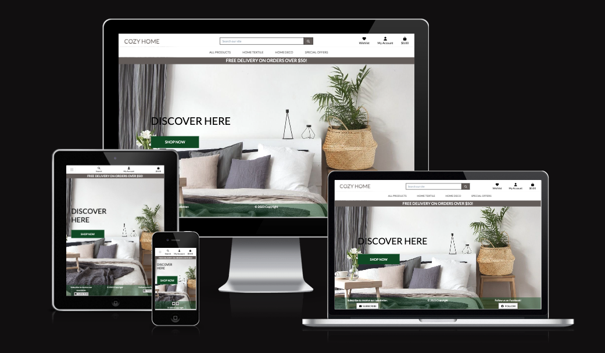

# Cozy Home

[View the live project here.](https://my-cozy-home-c15fa3106139.herokuapp.com/)

Cozy Home is an E-Commerce website for an online store named “Cozy Home”. Users can see products by categories and purchase them online. Users can register a profile, add products to wishlist, leave reviews, save delivery information, subscribe for a newsletter.

The website is designed to be responsive on a range of devices.

## Business and Customer Goals

The business model is B2C (Business to Customer). Customers can purchase goods online making individual card payments through the Stripe payment system.

#### Overview
Cozy Home is a website for an online store. The main goal of the website is to allow users to view the products and to buy them online. Also the website makes it possible for users to add products to a wishlist, to save delivery information on a personal profile page, to subscribe for a newsletter, and to read and leave reviews.

#### Site User
- Someone who is an interior designer.
- Someone whose hobby is interior design.
- Someone looking for new bed linen or towels.
- Someone who prefers online shopping.

#### Goals for the website
- To allow customers to view the products, their images, description, price.
- To allow customers to add products to a wishlist.
- To allow customers to add products to a shopping bag.
- To allow customers to make secure online payment.
- To allow customers to receive a confirmation email after checkout.
- To allow customers to subscribe for a newsletter.
- To allow customers to save their delivery information on a personal profile page.
- To allow store owner to add, edit and delete products.
- To allow store owner to view the list of subscribers.

### User Stories

#### Completed User Stories

Click on a user story to see the details.

1. [USER STORY: List of products](https://github.com/konstanciaa/cozy-home/issues/1)

2. [USER STORY: Product details](https://github.com/konstanciaa/cozy-home/issues/2)

3. [USER STORY: Special offers](https://github.com/konstanciaa/cozy-home/issues/3)

4. [USER STORY: View total](https://github.com/konstanciaa/cozy-home/issues/4)

5. [USER STORY: Wish list](https://github.com/konstanciaa/cozy-home/issues/5)

6. [USER STORY: Register an account](https://github.com/konstanciaa/cozy-home/issues/6)

7. [USER STORY: Login and logout](https://github.com/konstanciaa/cozy-home/issues/7)

8. [USER STORY: Email confirmation](https://github.com/konstanciaa/cozy-home/issues/9)

9. [USER STORY: User profile](https://github.com/konstanciaa/cozy-home/issues/10)

10. [USER STORY: Sort products by price](https://github.com/konstanciaa/cozy-home/issues/11)

11. [USER STORY: Sort a category](https://github.com/konstanciaa/cozy-home/issues/12)

12. [USER STORY: Search for a product](https://github.com/konstanciaa/cozy-home/issues/13)

13. [USER STORY: Select quantity of a product](https://github.com/konstanciaa/cozy-home/issues/14)

14. [USER STORY: View bag](https://github.com/konstanciaa/cozy-home/issues/15)

15. [USER STORY: Adjust quantity of items in bag](https://github.com/konstanciaa/cozy-home/issues/16)

16. [USER STORY: Enter payment details](https://github.com/konstanciaa/cozy-home/issues/17)

17. [USER STORY: Secure payment details](https://github.com/konstanciaa/cozy-home/issues/18)

18. [USER STORY: Order confirmation](https://github.com/konstanciaa/cozy-home/issues/19)

19. [USER STORY: Email confirmation](https://github.com/konstanciaa/cozy-home/issues/20)

20. [USER STORY: Add products](https://github.com/konstanciaa/cozy-home/issues/21)

21. [USER STORY: Update products](https://github.com/konstanciaa/cozy-home/issues/22)

22. [USER STORY: Delete products](https://github.com/konstanciaa/cozy-home/issues/23)

23. [USER STORY: Leave a review](https://github.com/konstanciaa/cozy-home/issues/24)

24. [USER STORY: Read reviews](https://github.com/konstanciaa/cozy-home/issues/26)

25. [USER STORY: Subscribe for a newsletter](https://github.com/konstanciaa/cozy-home/issues/27)

26. [USER STORY: View the wishlist](https://github.com/konstanciaa/cozy-home/issues/29)

27. [USER STORY: Remove from wishlist](https://github.com/konstanciaa/cozy-home/issues/30)

28. [USER STORY: Add to bag from wishlist](https://github.com/konstanciaa/cozy-home/issues/31)

29. [USER STORY: List of subscribers](https://github.com/konstanciaa/cozy-home/issues/32)

#### Future features user stories

1. [USER STORY: Recover password](https://github.com/konstanciaa/cozy-home/issues/8)

2. [USER STORY: Moderate reviews](https://github.com/konstanciaa/cozy-home/issues/25)

3. [USER STORY: Check a box to subscribe](https://github.com/konstanciaa/cozy-home/issues/28)

## UI/UX Design

### Color Scheme

There is a big image of a cozy bedroom on the home page. The page gives an idea of what is the website about and sets an appropriate mood.

The color scheme comes mainly from the home page image.

I added bright green color (#0d5328) for "Shop now" and "Add to bag" buttons. 

rgb(255, 0, 85) - for wishlist

### Wireframes

Home page

All products page

Product details page

Shopping bag page

## Database Design

## Features

#### User based Features Implemented

- **Users can** register on a website
- **Users can** log into their account
- **Users can** log out of their account
- **Users can** view all the products and their details
- **Users can** search products on the website
- **Users can** sort the products by categories, price, rating
- **Users can** read and leave reviews
- **Users can** add products to wishlist
- **Users can** delete products from wishlist
- **Users can** add products to bag
- **Users can** add products from wishlist to bag
- **Users can** adjust quantity of products in their wishlist
- **Users can** adjust quantity of products in their shopping bag
- **Users can** make a secure online payment
- **Users can** subscribe for a newsletter
- **Users can** save their delivery information on their profile
- **Users can** update their personal information on their profile

#### User Restrictions
- **Users cannot** access the subscription form until they sign up or login
- **Users cannot** access wishlist until they sign up or login
- **Users cannot** leave a review until they sign up or login
- **Users cannot** see other users profiles
- **Users cannot** see other users wishlists
- **Users cannot** see subscribers list
- **Users cannot** add, edit or delete products

#### Business owner based Features implemented

- **Business owner can** add products **(Create)**
- **Business owner can** view all products **(Read)**
- **Business owner can** edit products **(Update)**
- **Business ownern can** delete products **(Delete)**
- **Business owner can** view the list of subscribers

### Website Features

#### Navigation

- The navigation is located at the top of the page. It shows the store name in the left corner: COZY HOME that links to home page.
- The other navigation links are: All Products, Home Textile, Home Deco, Special Offers which link to different categories of products.
- A search bar is located above the product categories link.
- Wishlist, My Account and Bag icons function as links to these pages.

#### Home page
- Home page displays a photo of a cozy bedroom.
- The big green button calls to action "Shop Now".
- After clicking the button, users are being redirected to products page.
- The information about free delivery condition is at the top of the image, between navigation links and hero image.

#### Footer
- Users can see a Subscribe button which redirects them to subscription page. If the user is not registered or not logged in, they are being redirect to login page.
- The Follow button opens the store's Facebook page in a new tab.

#### Products
- User can see all products, their names, prices, categories, rating under images.
- The heart icon under each product enables users to add a product to a wishlist. If the user isn't logged in, they are being redirected to login page first.
- Users can tap a product image to see more details about the product.
- "Sort by..." bar ebnables users to sort products by categories, price, name, rating in different directions.

#### Product details page
- Users can tap a product image on products page to see more details about the product.
- On Product details page users can read a description and reviews.
- Users can select the needed quantity and add a product to their shopping bag by clicking "Add to bag" button.
- Users can get back to products page by clicking "Keep shopping" button.
- Users can add a product to their wishlist by clicking "Add to wishlist" button.

#### Reviews and ratings
- Users can read reviews on products details page.
- Users can leave a review and rate a product when they are logged in.

#### Wishlist
- Logged in users can add products to their wishlist.
- Users are being redirected to their wishlist when they add a product.
- Users can tap a heart icon in th etop right corner to view their wishlist.
- When users are on the wishlist page, the icon is red color.
- Users can adjust quantity of a product and add it to a bag.
- Users can remove a product from their wishlist.
- Users can click "Keep shopping" button to get back to products page.
- Users can click "Secure checkout" button to proceed to checkout.
- Users can see a bag icon with total price in the top right corner of the page.
- Users can click a bag icon to get to a shopping bag page.

#### Shopping bag page
- Users can see the products the added to the bag.
- Users can adjust quantity of each product.
- Users can see a product's price and subtotal price, which depends on a product's quantity.
- In the bottom right corner users can see bag total, delivery costs, grand total, and how much they can spend to get free delivery.
- "Keep shopping" button redirects users to products page.
- "Secure checkout" opens checkout page.

#### Checkout page
- Users can see products which they added to thei rshopping bag, their quantity and price.
- Users can see delivery costs and grand total.
- Users can fill out the form with their delivery information.
- Users can click a checkbox to save their delivery information to their profile so they don't have to enter it next time.
- Users can secure enter their card details.
- Users can click "Adjust bag" button to get back to shopping bag page.
- Users can click "Complete order" button to make a purchase. After that their card will be charged.

#### Sign Up page
- Users can fill out he form to register on the website.

#### Login page
- Users can enter their username or email and password to log into their account.

#### Profile
- Users can view their personal profile page.
- Users can see their delivery information if they clicked a checkbox to save it to their profile when making an order.
- On the right side of the page users can view their order history.
- Users can update theur delivery information simply by entering new details and clicking "Update information" button.

#### Subscription
- Logged in users can subscribe to a newsletter.
- "Subscribe" button is located at the bottom of the home page.
- If users are not logged in, they are being redirected to login page after clicking "Subscribe" button.
- Users can use the form to enter their name and email.
- After clicking "Subscribe" button under the form, users are successfully subscribed.

#### Useful links
- Users can see a navigation link to Useful links page when clicking "My Account" icon.
- On Useful links page users can see and follow links to external resources, such as blog posts, articles or YouTube videos related to website's specialization.
- Users can click "Keep shopping" button to get to products page.

#### Store Owner functionality
- Store owners can access additional features by clicking "My Account" icon in navigation.
- Store owners have additional access to Product management and Subscribers page

#### Product management
- Store owners can fill the form to add a new product.

- Store owners can edit or delete products by clicking "Edit" or "Delete" on Products or Product detail page.

#### Newsletter subscribers
- Store owner can see a list of subscribers, their names and emails.

### Future features

## Marketing
ECommerce business model. Purpose of the appliication. B2C. Marketing Strategies. Facebook

#### Facebook business page.

Tap [here](https://www.facebook.com/mycozyhomehere/) to see the page on Facebook.

## Testing
- Responsiveness
- Browser Compatibility
- Bugs (resolved and unresolved)
- Lighthouse
- Validation (HTML, CSS, Python)
[Validation results](https://github.com/konstanciaa/cozy-home/tree/main/static/assets/docs/validation)

- User Stories Testing
- Features Testing

## Technologies Used
Frameworks, Libraries, Programs

## Procedures

### Deployment
The project's repo was hosted on GitHub and deployed on Heroku

#### Create a database

- Log in to [ElephantSQL.com](https://www.elephantsql.com/) to access dashboard
- Create New Instance
- Copy the database URL and add it to Heroku config var

#### Heroku

[Heroku](https://id.heroku.com/login)

- Sign up / login to [Heroku](https://id.heroku.com/login) website
- Create new app
- Add the config var DATABASE_URL, and for the value, copy in your database url from ElephantSQL.

#### Installing Project Requirements
- In the terminal, install dj_database_url and psycopg2, both of these are needed to connect to the external database. `pip3 install dj_database_url==0.5.0 psycopg2`
- Update requirements.txt file with the newly installed packages. `pip freeze > requirements.txt`
- In settings.py file, import dj_database_url underneath the import for os.
- Scroll to the DATABASES section and update it to the following code, so that the original connection to sqlite3 is commented out in order to connect to the new ElephantSQL database instead. Paste in the ElephantSQL database URL in the position indicated.
`     
 DATABASES = {
     'default': dj_database_url.parse('your-database-url-here')
 }
`

- In the terminal, run the showmigrations command to confirm you are connected to the external database. `python3 manage.py showmigrations`

- Migrate your database models to your new database.

- Create a superuser for your new database. `python3 manage.py createsuperuser`

- Install gunicorn

- Freeze requirements 

- Create Procfile

- Disable collectstatic on Heroku

- Add the hostname of Heroku app to ALLOWED_HOSTS in settings.py

- Deploy an app

### Connecting Heroku to Github

By connecting Heroku to Github the application will automatically deploy the latest code to Heroku.

- in heroku app, open app, in "Deploy" tab, under the "Deployment method" setting select "GitHub"
- search for repository and click "Connect"
- choose "Enable Automatic Deploys"
- modify `settings.py` to use environment variables
- add the environment variables to Heroku
- confirm Heroku to Github connection

### The Development Environment

Set up a local development environment so that you don't have to change any settings to run the project in gitpod.

- modify `settings.py`:
  - create a new "development" variable
  - set "Debug" to development
  - modify the "DATABASES" configuration and add an if statement
  - add a "localhost" as an ALLOWED_HOST if development = True
  - else use the HEROKU_HOSTNAME environment variable
- add a new environment variable set to TRUE
- restart workspace
- run server

### Config vars

A series of config vars have to be created in Heroku, to conect the app to Django, AWS, stripe and email.

The final list of config vars in Heroku can be seen below

### Github

#### Create a new repository

- Log into [GitHub](https://github.com/)
- On the 'Repositories' tab click 'New'
- Name the repository and click 'Create repository'

#### Forking

- Sign into Github and go to my [repo](https://github.com/konstanciaa/cozy-home)
- Press the "Fork" button the top right corner of page
- Click "Create fork"

#### Cloning

- Sign in to Github and go to my [repo](https://github.com/konstanciaa/cozy-home)
- Above the list of files click "Code"
- Select HTTPS, SSH or Github CLI, then click the copy button to get the URL
- Open your IDE of choice
- Type "git clone" and then paste the URL you copied
- Press Enter

[Cloning a repository In GitHub documantation](https://docs.github.com/en/repositories/creating-and-managing-repositories/cloning-a-repository)

### AWS S3 Bucket Creation

### Stripe Configuration

## References and Credits
Boutique Ado. 

Media and Content. Pexels

